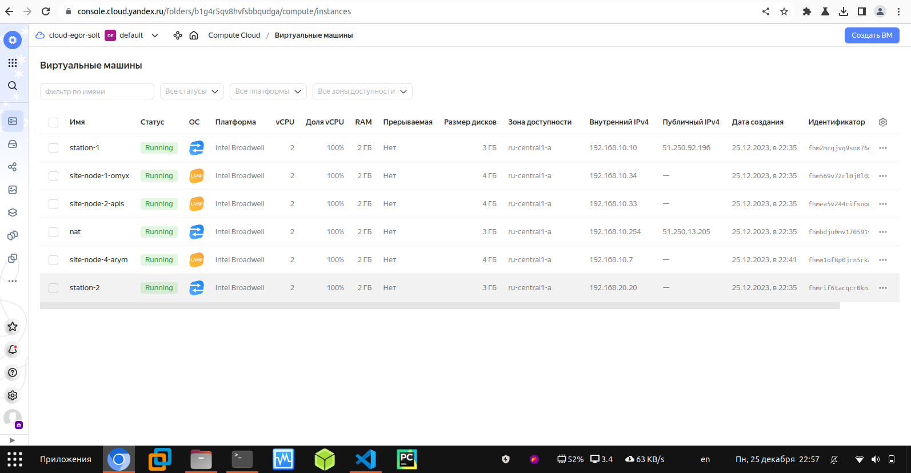

### Задание 1. Yandex Cloud

1. Создать бакет Object Storage и разместить в нём файл с картинкой:
Создать бакет в Object Storage с произвольным именем (например, имя_студента_дата).
Положить в бакет файл с картинкой.
Сделать файл доступным из интернета.

2. Создать группу ВМ в public подсети фиксированного размера с шаблоном LAMP и веб-страницей, содержащей ссылку на картинку из бакета:
Создать Instance Group с тремя ВМ и шаблоном LAMP. Для LAMP рекомендуется использовать image_id = fd827b91d99psvq5fjit.
Для создания стартовой веб-страницы рекомендуется использовать раздел user_data в meta_data.
Разместить в стартовой веб-странице шаблонной ВМ ссылку на картинку из бакета.
Настроить проверку состояния ВМ.

3. Подключить группу к сетевому балансировщику:
Создать сетевой балансировщик.
Проверить работоспособность, удалив одну или несколько ВМ.

Решение:
Terraform manifest: [yandex_cloud](https://github.com/george25031996/cloud_pro-netology/tree/main/2.0/yandex_cloud) 

Ресурсы:

Удаляю одну из ВМ для проверки, что при активном балансировщике всё будет работать штатно

Проверяю, что всё работает штатно и ничего не сломалось:

