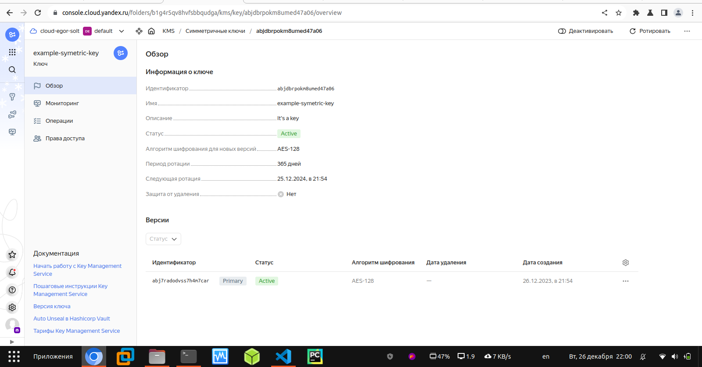
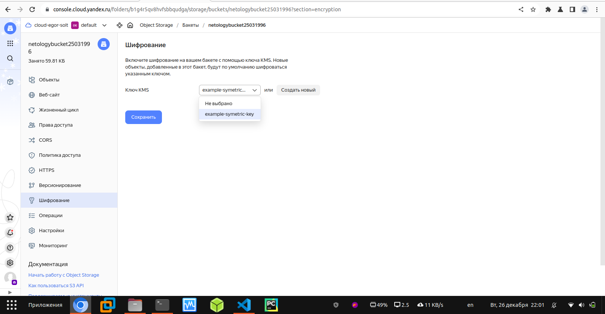

### Домашнее задание к занятию «Безопасность в облачных провайдерах»

## Задание 1. Yandex Cloud

С помощью ключа в KMS необходимо зашифровать содержимое бакета:
создать ключ в KMS;
с помощью ключа зашифровать содержимое бакета, созданного ранее.

Решение:

Изменённый bucket:

